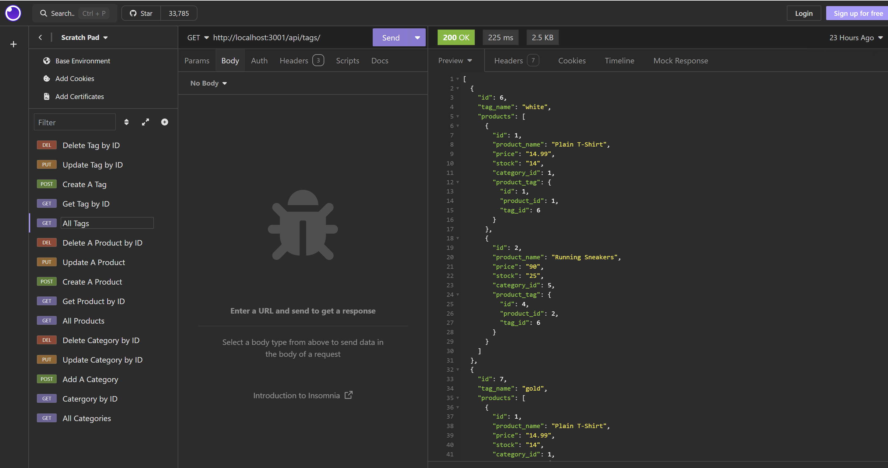
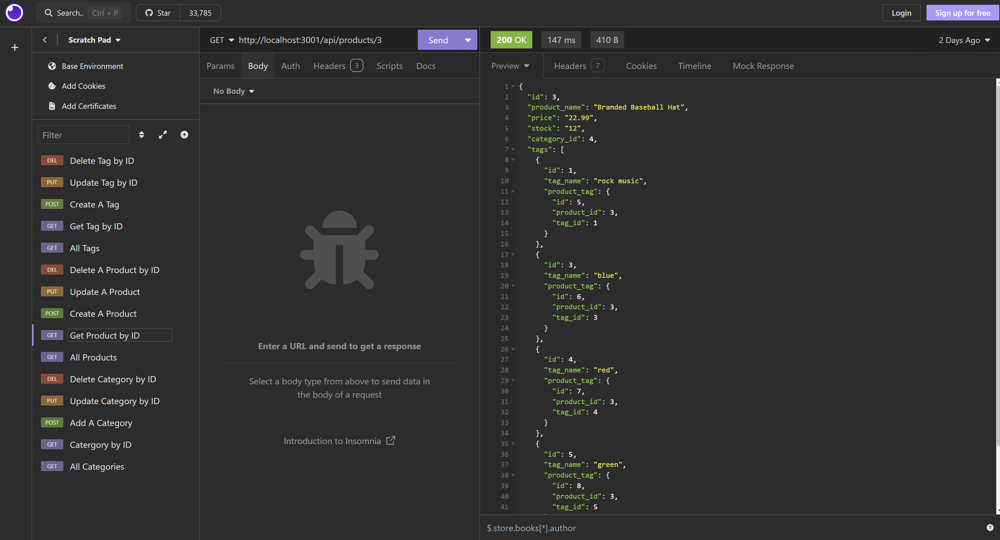

# 13 Object-Relational Mapping (ORM): E-Commerce Back End

## Description
E-commerce website to manage products, category and tag of each product using sequelize and express
## Table of Contents
- [Installation](#installation)
- [Usage](#usage)
- [Contributing](#contributing)
- [Tests](#tests)
- [License](#license)
- [Questions](#questions)

## Installation
You need to npm i to install express server and sequelize in order to run the program using npm start. You can start using the webside from http://localhost:3001/ or using the render website attached in this readme.

## Usage
This can be use to create a complete e-commerce website to manage products.
## Contributing

## Tests
Use local or website and insomnia to test the program by add/update/delete/show product/category/tag/
## License

No license

## Media
### Example Photo

### Example Video
[Watch the Video]()

* The URL of the deployed application.
[link to the website](https://note-taker-r4nt.onrender.com/)

## Questions
If you have any questions, please reach out to me:

GitHub: [thegreatwall88](https://github.com/thegreatwall88)
Email: thegreatwall88@gmail.com
